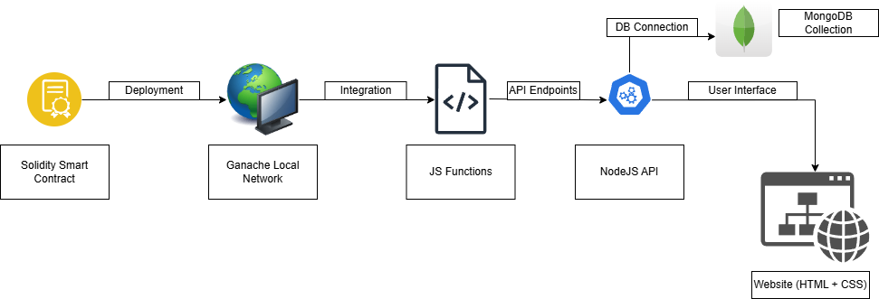
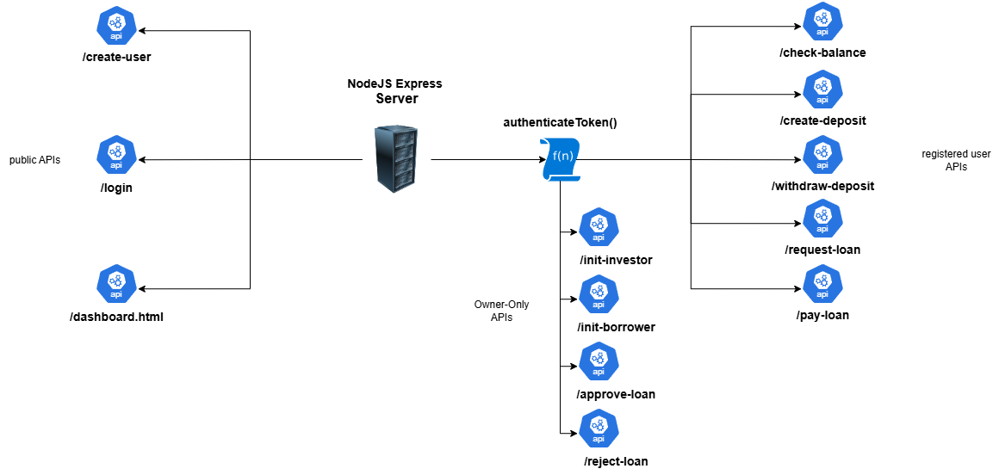
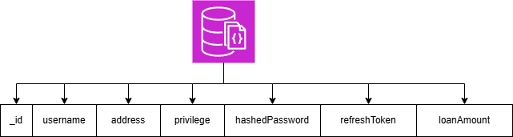
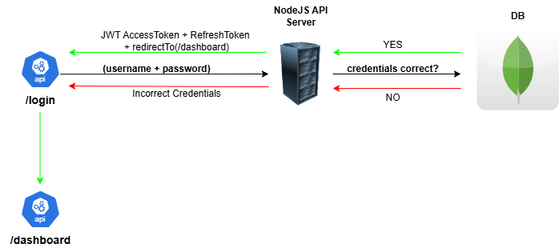

# DeCap (Decentralized Capital)
A Decentralized Financial Platform for creating fixed deposits and loan lending in banking applications.

## Summary
DeCap is a blockchain-powered decentralized platform for fixed deposits and loan lending. The application leverages blockchain technology to ensure transparency, immutability, and security in financial operations. Users can manage their deposits, request loans, and pay off debts, all within a seamless interface.

## Features
- Decentralized deposit and loan functionalities.
- Secure authentication using JWT.
- Real-time financial operations with blockchain transparency.
- User-friendly interface with responsive design.

## Architecture

## API Interactions

## MongoDB Auth Setup

## JWT Auth Scenario

